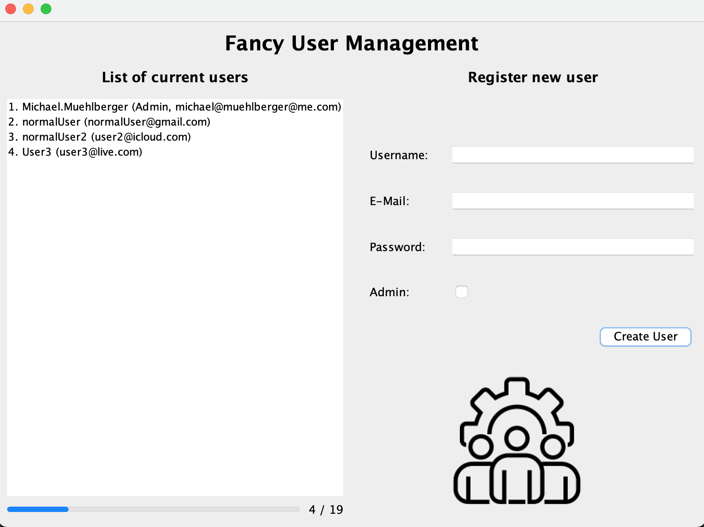

# User Management #
## Description ##
The program contains a basic UI of a Mangamenet screen, the user can add a user with their username, password and email adress and can then decide whether the user is an admin or not. The user then gets added to the list on the side. A max of 19 users is possible. 

# Screenshots of output #

